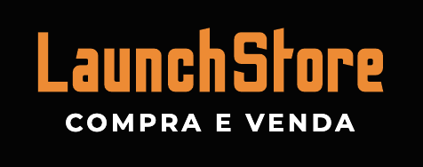

<!-- PROJECT LOGO -->
<br />
<p align="center">
  
  <h3 align="center">LaunchStore</h3>
</p>

<div align="center">

  <!-- PROJECT SHIELDS -->
  [![Forks][forks-shield]][forks-url]
  [![Stargazers][stars-shield]][stars-url]
  [![MIT License][license-shield]][license-url]
  [![LinkedIn][linkedin-shield]][linkedin-url]
  
</div>

<!-- TABLE OF CONTENTS -->
## Table of Contents

* [About the Project](#about-the-project)
  * [Built With](#built-with)
* [Getting Started](#getting-started)
  * [Prerequisites](#prerequisites)
  * [Installation](#installation)
* [Usage](#usage)
* [Roadmap](#roadmap)
* [Contributing](#contributing)
* [License](#license)
* [Contact](#contact)


<!-- ABOUT THE PROJECT -->
## About The Project

![home][home]

This software aims to make the intermediary between the stakeholders of a business. Users will be able to register multiple products in their account and await notification of interest from someone else. After the alert, such as automatic contact exchange, they can finalize the deal.

Goals:
* to create opportunities
* to connect people
* to facilitate and accelerate business
* to rejoice stakeholder

### Built With
The frameworks that the project contemplates are:
* [Node.JS](https://nodejs.org/en/)
* [Nodemon](https://nodemon.io/)
* [Express](http://expressjs.com/)
* [Nunjucks](https://mozilla.github.io/nunjucks/)
* [PostgreSQL](https://www.postgresql.org/)
* [Lottie](https://lottiefiles.com/)
* [Mailtrap](https://mailtrap.io/)

Other libraries were used during development, such as ...

  > bcryptjs, faker, nodemailer, browser-sync 


<!-- GETTING STARTED -->
## Getting Started

To get a local copy up and running follow these simple example steps.

### Prerequisites

This is an example of how to list things you need to use the software and how to install them.
* npm 
```sh
npm install npm@latest -g
```

### Installation

1. Clone the repo
```sh
git clone https://github.com/KayoRenato/LaunchStore.git
```
3. Install NPM packages
```sh
npm install
```
4. Config PostgreSQL `src/config/db.js`
```JS
  user: "USER_NAME",
  password: "",
  host:"localhost",
  port: 5432,
  database: "DATABASE_NAME"

```
5. Copy schema SQL and paste in PostgreSQL and follow steps (in file sql) for each run query
```JS
database.sql;
```
6. Create seeds `seed.js`, to test the software (optional)
```sh
node seed.js
```

<!-- USAGE EXAMPLES -->
## Usage

__User Creation__
![user-creation][user-creation]

__Product Creation__

![product-creation][product-creation]

__Order Creation__

![order-creation][order-creation]

__Password Recovery__

![password-recovery][password-recovery]

__Sale Completion__

![sale-completion][sale-completion]

<!-- ROADMAP -->
## Roadmap
The software is a Minimum Viable Product (MVP), so it will be necessary to improve the features before its implementation.


<!-- CONTRIBUTING -->
## Contributing

Contributions are what make the open source community such an amazing place to be learn, inspire, and create. Any contributions you make are **greatly appreciated**.

1. Fork the Project
2. Create your Feature Branch (`git checkout -b feature/AmazingFeature`)
3. Commit your Changes (`git commit -m 'Add some AmazingFeature'`)
4. Push to the Branch (`git push origin feature/AmazingFeature`)
5. Open a Pull Request


<!-- LICENSE -->
## License

Distributed under the MIT License. See [license][license-url] for more information.

<!-- CONTACT -->
## Contact

Kayo Renato - [LinkedIn](https://www.linkedin.com/in/kayo-renato/) - kayorenatocontato@gmail.com

Project Link: [https://github.com/KayoRenato/LaunchStore](https://github.com/KayoRenato/LaunchStore)


<!-- MARKDOWN LINKS & IMAGES -->
[forks-shield]: https://img.shields.io/github/forks/KayoRenato/LaunchStore?style=for-the-badge
[forks-url]: https://github.com/othneildrew/Best-README-Template/network/members

[stars-shield]: https://img.shields.io/github/stars/KayoRenato/LaunchStore?style=for-the-badge
[stars-url]: https://github.com/KayoRenato/LaunchStore/stargazers

[license-shield]: https://img.shields.io/github/license/KayoRenato/LaunchStore?style=for-the-badge
[license-url]: https://github.com/KayoRenato/LaunchStore/blob/master/LICENSE

[linkedin-shield]: https://img.shields.io/badge/-LinkedIn-black.svg?style=for-the-badge&logo=linkedin&colorB=555
[linkedin-url]: https://www.linkedin.com/in/kayo-renato/


<!-- USAGE EXAMPLES GIF & IMAGES -->
[home]: assets/img/homepage.png
[user-creation]: assets/img/user.gif
[product-creation]: assets/img/product.gif
[order-creation]: assets/img/order.gif
[password-recovery]:assets/img/password.gif
[sale-completion]: assets/img/sale.gif


